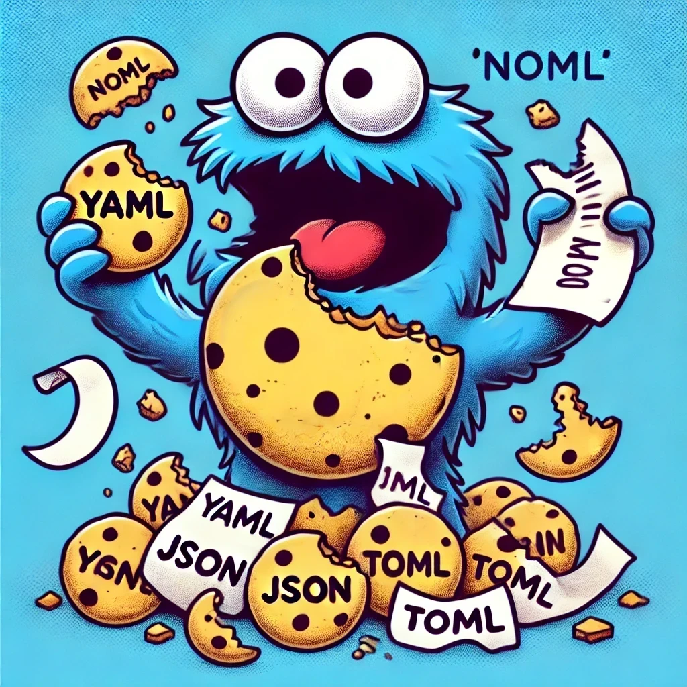

# 🍪 NoML



'NoML' (No Markup Language) is a tool that will release the configuration hating monster onto your project. It will eat all the configuration files it can find and move on.

_This is obviously a fun project, don't use this at work, at home, or on your server. The monster is dangerous and needs to be fed with caution._

## Usage

Just go to your least favorite project directory and execute:

```bash
npx noml
```
